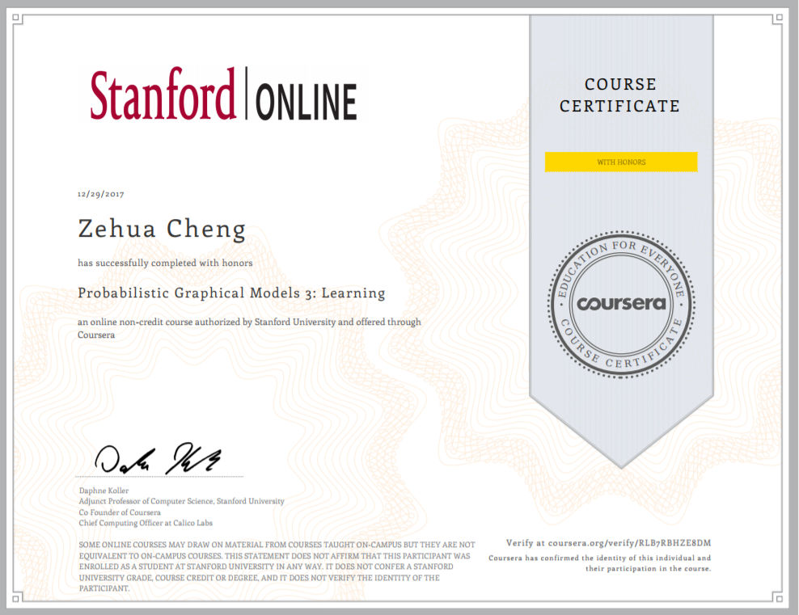

## Probabilistic Graphical Models 1: Representation

Probabilistic graphical models (PGMs) are a rich framework for encoding probability distributions over complex domains: joint (multivariate) distributions over large numbers of random variables that interact with each other. These representations sit at the intersection of statistics and computer science, relying on concepts from probability theory, graph algorithms, machine learning, and more. They are the basis for the state-of-the-art methods in a wide variety of applications, such as medical diagnosis, image understanding, speech recognition, natural language processing, and many, many more. They are also a foundational tool in formulating many machine learning problems. 

This course is the third in a sequence of three. Following the first course, which focused on representation, and the second, which focused on inference, this course addresses the question of learning: how a PGM can be learned from a data set of examples. The course discusses the key problems of parameter estimation in both directed and undirected models, as well as the structure learning task for directed models. The (highly recommended) honors track contains two hands-on programming assignments, in which key routines of two commonly used learning algorithms are implemented and applied to a real-world problem.

### Programming Assignment

1. CRF Learning for OCR
2. Learning Tree-structured Networks
3. Learning with Incomplete Data